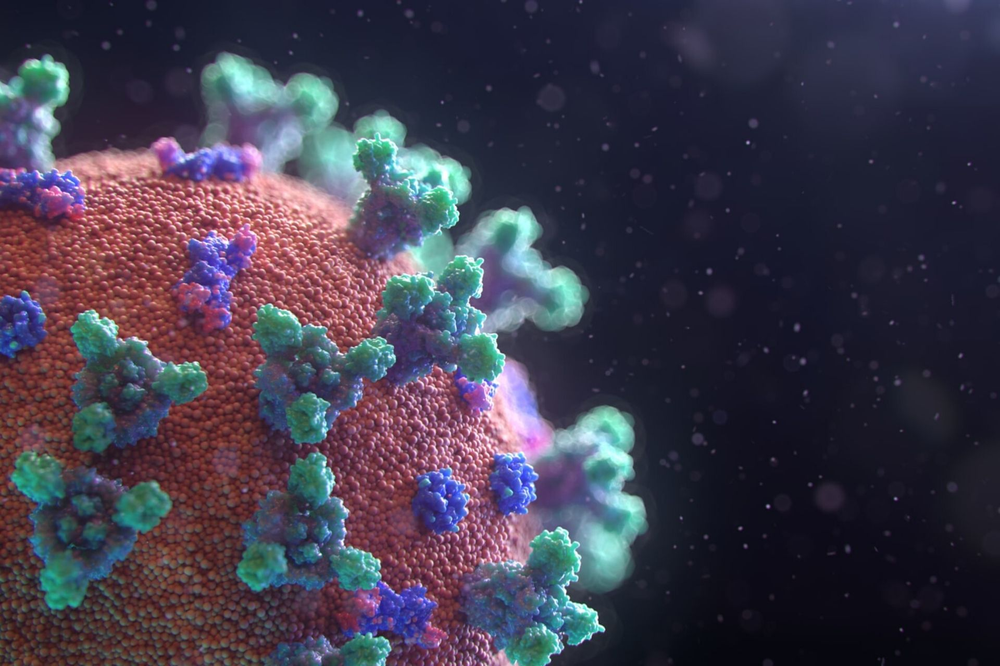

# Equipo 24 proyecto final

# Análisis de gravedad y letalidad del virus SARS-CoV-2(Covid-19) ⚙️

_Conociendo la gravedad de la situación que vivimos en la actualidad, es de suma importancia analizar algunos detalles que han influenciado que esta pandemia tenga tantas repercusiones y cambios en nuestras vidas._



## Comenzando 🚀

_Puedes descargar el repositorio y consultar el Código en lenguaje de programación R sobre el análisis realizado de las siguientes maneras:_

- Dando clic en **Code** en el repositorio y después **Download ZIP**..
- Haciendo un **Git clone** del repositorio directamente en tu computadora

### Prerrequisitos 📋

_Para poder observar en análisis, gráficas y datos que se presentan en este proyecto, debes tener instalado el lenguaje de programación **Python** en tu ordenador, así como cualquier IDE que pueda soportar este lenguaje, te recomendamos "VScode", "Anaconda", "JupiterNotebooks", pero una opción mas sencilla es utilizar y ejecutar el script en Google Colab si así lo deseas._

_De igual forma debes se debe tener en cuenta que se ocuparon API y data-sets de páginas como **Kaggle**, así que es de suma importancia tener descargados estos data-sets o tener la URL de la API para apreciar el análisis completo_


### Instalación 🔧

_Para el desarrollo del Código se utilizaron ciertas librerías de Python que facilitaron el análisis y la extracción de datos_

_Las librerías son las siguientes:_

```python
#Cargar las librerias
import pandas as pd
import requests
import matplotlib.pyplot as plt
import os
import numpy as np
import seaborn as sns
from datetime import datetime
```

_Con todo lo anterior contemplado, se puede correr el Código y observar el análisis del proyecto._

## Desarrollo y Análisis de gravedad y letalidad del virus SARS-CoV-2(Covid-19) ⚙️

###  Análisis de la Pandemia Covid-19 ⚙️

_El link al script del proyecto en colab lo encuentras dando click en el siguiente texto_ [Proyecto Final](https://colab.research.google.com/drive/1AluD2MxsyCHlfisPtPyQAGkY3xXQNMnN?usp=sharing)

## Autores ✒️

_Este proyecto fue realizado por el equipo 24 del programa Santander-DataScience, cuyos integrantes son:_

**Equipo 24:**
- **Oscar Cañongo** - \*\* - [OscarCanongo](https://github.com/OscarCanongo)
- **Andres** - \*\* - [andresam0301](https://github.com/andresam0301)
- **Daniel Arellano** - \*\* - [Tachuelin](https://github.com/Tachuelin)
- **Miguel Toledo** - \*\* -[josemigueltr](https://github.com/josemigueltr)
